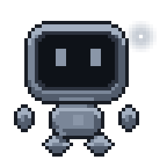
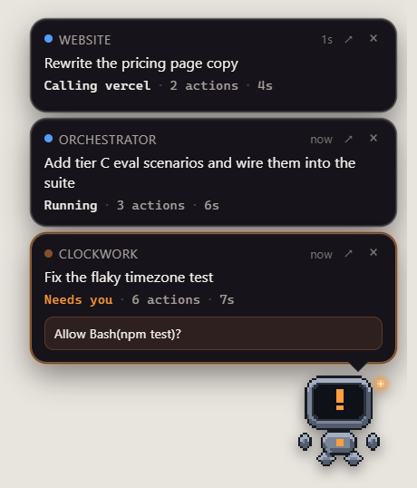
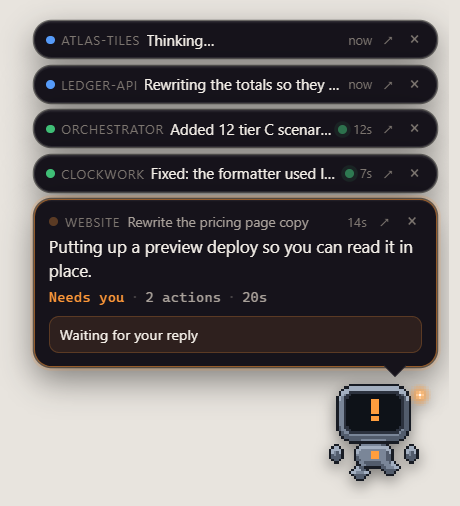
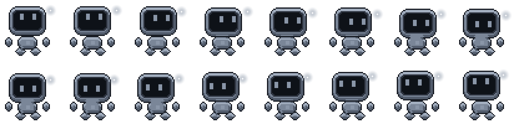

<p align="center">
  
</p>

<h1 align="center">Pipsqueak</h1>

<p align="center">
  <strong>Your coding agent, in the corner of your eye.</strong>
</p>

<p align="center">
  <a href="LICENSE"></a>
  <a href="https://github.com/tristanmuzzu/pipsqueak/releases"></a>
  <a href="#how-it-actually-works"></a>
  <a href="#privacy"></a>
  <a href="#the-pets"></a>
</p>

<p align="center">
  <a href="#install">Install</a> &nbsp;•&nbsp;
  <a href="#what-you-actually-see">What you see</a> &nbsp;•&nbsp;
  <a href="#more-than-one-project">Many projects</a> &nbsp;•&nbsp;
  <a href="#the-pets">Pets</a> &nbsp;•&nbsp;
  <a href="#what-it-refuses-to-say">What it refuses to say</a>
</p>

---

Claude Code is off doing something for four minutes. You could sit there watching
it scroll, or you could do something else and miss the moment it needs you.

Pipsqueak is a small pet that sits on top of everything and tells you, in plain
sentences, what your agent is doing right now — and shuts up when there's nothing
to say. Not a spinner. Not a tool name. **The sentence Claude just wrote about
what it's doing**, lifted straight out of the session as it happens.



<sub>Recorded by `npm run demo`, which paints its own backdrop and drives the real
app with simulated sessions — reproducible, and nobody's desktop in frame.</sub>

## Why this exists

I kept alt-tabbing to a terminal to find out whether Claude was still working,
had finished ten minutes ago, or had been sitting on a permission prompt the
whole time. That last one is the worst: an agent silently waiting on you is dead
time you're paying for in both directions.

Status lines don't fix it, because they live in the window you're not looking at.
So the status moved out of the window: a pet on top of everything, one card per
project, and a live line saying what's happening — close enough to your cursor
that you read it without meaning to.

## What you actually see

```
● CLOCKWORK  Timezone test flakiness           3m  ↗  ×
It parses in local time and compares in UTC.
That is the bug. Rewriting the assertion.
Editing · 42 actions · 3m
```

| Line | Where it comes from | How often it changes |
| --- | --- | --- |
| **Project · chat** | the git repository, and the chat's own title in the Claude Code desktop app | basically never |
| **The live line** | what Claude last said, or the last line of what it was thinking | every ~20 seconds |
| **Status** | the *category* of work, plus counters | when the category does |

The live line gets the space because it's the one that moves. Hooks alone can
only ever tell you "Editing render.js" — the category of the thing, never the
point of it. The point is in the sentence Claude writes just before it reaches
for the tool, and Claude Code appends that to the session transcript as it goes.
Pipsqueak follows the transcript: only the bytes since the last poll, only the
newest line, never past a half-written one. Nothing leaves your machine.

Prefer it quieter? The menu offers **silence**, **only what Claude says to you**,
or **what it says and thinks** (the default, and the one that feels alive).

- **↗ opens that chat.** Not "some Claude window" — that exact conversation, by
  id, in the desktop app.
- **× dismisses.** A finished card says **Done** and waits until you've seen it,
  then goes away completely.
- **Click a card** for the last two dozen things that project did.
- **`Ctrl+Alt+P`** shows and hides the whole thing from anywhere. If something
  else owns that chord, Pipsqueak takes the next free one and tells you which.

## More than one project

Run agents in four repos and you get four cards, not one bubble flickering
between them. Past three, the stack stops growing and collapses: the one you're
watching keeps its card, everything else becomes a single line that still says
what it's doing and still closes. Click any line to hand it the card. Anything
that starts needing you takes the card back on its own.



## Install

**Windows 10/11.** Download the installer from
[Releases](https://github.com/tristanmuzzu/pipsqueak/releases) and run it. It
needs the Edge WebView2 runtime, which ships with Windows 11 and installs itself
if missing.

On first launch a panel offers to register the Claude Code hooks — the only step
that touches your config, and it says exactly what it edits. Then **restart
Claude Code**, because it reads its hooks at startup. That's it.

There's a plugin too, if you'd rather drive the pet from inside a session:

```bash
/plugin marketplace add tristanmuzzu/pipsqueak
```

> macOS and Linux are untested. The code is portable and the bundle targets
> exist; if you build it there, a report either way is welcome.

### What it does to your settings

`~/.claude/settings.json` is usually hand-tuned, so the installer copies it
first, refuses to run if it isn't valid JSON, and only ever removes entries whose
command path contains `pipsqueak`. Uninstalling takes the hooks with it.

The hooks are `async` and **never write to stdout**, which is the load-bearing
part: a hook that prints on `PermissionRequest` can approve or deny a tool call.
This one writes a file and exits, so Claude Code's prompts are exactly what they
would be without it, and the pet crashing can't affect a session.

## The pets


| | State | When |
| --- | --- | --- |
| 💤 grey | `idle` | nothing running |
| 🔵 blue | `thinking` / `running` | prompt submitted, tool running |
| 🟠 orange | `waiting` | a prompt a human is actually looking at |
| 🔴 red | `failed` | the turn ended badly |
| 🟢 green | `done` | Claude finished |
| 🟣 purple | `compacting` | context compaction |

**They watch your cursor.** Every built-in pet is drawn in sixteen directions
and turns to face your pointer while it's resting, then goes back to work when
there's work. Poke one and it jumps.



Three ship in the box — Byte, Pip and Ember — and a pet is just a folder with a
sprite sheet and a small JSON file, so bring your own. **Pets built for the
Codex app work here unchanged**, both versions of that atlas, including any
already sitting in `~/.codex/pets`. It works the other way too.

## What it refuses to say

The whole thing is worthless if you can't trust one glance at it, so most of the
work went into *not* claiming things:

- **"Done" only when the turn is really over.** `Stop` fires whenever the
  assistant yields the floor, including when it's about to carry straight on.
  Pipsqueak checks `stop_hook_active`, `background_tasks` and `session_crons`
  first. A subagent reporting in afterwards is bookkeeping, not new work.
- **"Needs you" only after a prompt has gone unanswered for 800ms.**
  `PermissionRequest` fires *before* anyone is asked, and auto-mode settles most
  of them in a couple of hundred milliseconds. Crying wolf trains you to ignore
  the one that matters.
- **Nothing at all once the agent is gone.** A sweep retires sessions whose
  process has exited, and drops silent work back to idle after five minutes with
  the words "stopped responding" — not "done".
- **A dangerous command says so.** A force push, an `rm -rf`, a `DROP TABLE`
  gets a warning on the card that's asking you to approve it.

## Privacy

No telemetry, no analytics, no account, no server. The one network call in the
whole app is an update check that is **off by default**, asks GitHub for the
latest release tag, and downloads nothing.

Session files live in `~/.pipsqueak`, hold the project name, the current tool,
and the line the card is showing, and are deleted when the session ends. The
transcript the live line comes from is a file Claude Code already wrote to your
disk; Pipsqueak reads it and shows one line of it two inches from your cursor.

## How it actually works

Claude Code fires [hooks](https://code.claude.com/docs/en/hooks) at defined
moments. Pipsqueak registers a command hook on each relevant event pointing at
its own binary; each invocation reads the payload, turns it into a state plus a
line, and writes `~/.pipsqueak/sessions/<id>.json`. The overlay polls that
folder, joins in the transcript and the desktop app's own chat records, and
draws. No daemon, no port, no server. If the pet isn't running, the hooks are a
few milliseconds of file write and nothing else.

There's more of that — why `Stop` isn't "finished", how a session is matched to a
repository, what the sweep does — in [how it works](docs/guides/how-it-works.md).

## Docs

- [How it works](docs/guides/how-it-works.md) — hooks, state, and why each claim
  is delayed or withheld
- [Configuration and CLI](docs/guides/configuration.md)
- [Custom pets](docs/guides/custom-pets.md) — atlas format, timing, look
  directions, Codex compatibility
- [Building and releasing](docs/project/building.md)
- [Release notes](docs/releases/) · [Contributing](CONTRIBUTING.md)

## Star it

If Pipsqueak saves you one alt-tab, a star helps the next person find it. ⭐

## Credits

Not affiliated with Anthropic or OpenAI. The pet-on-your-desktop idea is
borrowed from the Codex app's companions; everything here is implemented from
scratch against the documented Claude Code hook API and the published pet atlas
contract.

MIT. Take it, fork it, make it yours.
