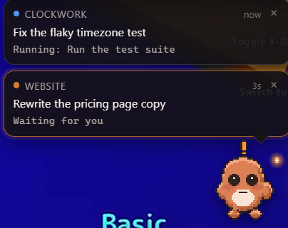
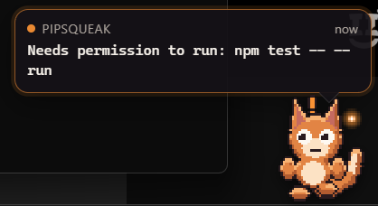
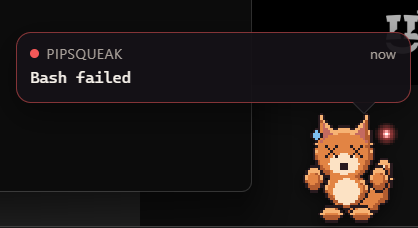

# Pipsqueak

A tiny desktop pet that shows what Claude Code is doing — without switching to it.

Pipsqueak sits in the corner of your screen on top of everything else. While
Claude Code works, the pet mirrors its state: thinking, running a tool, blocked
on a permission prompt, failed, or done. Watch a video, read a PR, do anything
else, and still know at a glance whether the agent is busy, stuck, or finished.



---

## Why

Long agent turns are dead time you can only spend elsewhere if you can tell,
without looking at the terminal, when the agent needs you back. A status line in
a window you're not looking at can't do that. A pet on top of everything can.

The bit that actually matters is **waiting**: the pet turns orange and starts
pulsing the moment Claude Code blocks on a permission prompt, so a turn never
sits stalled for ten minutes while you're in another window.

## Features

- **Transparent always-on-top overlay** — no taskbar entry, no window chrome.
- **Click-through everywhere except the pet.** The overlay does not eat clicks
  meant for whatever is underneath it. Most pet overlays get this wrong.
- **One card per project, stacked.** Run Claude Code in four repos and you get
  four cards, not one bubble flickering between them. Press **×** to collapse a
  project into a chip; it reopens itself if that project gets blocked or fails.
- **Readable at speed.** Each card has a *headline* — what the turn is about —
  that changes once per turn, and a dimmer live line for the current tool. The
  live line has a floor on how often it may change, so nothing flashes past.
- **An event log** — click a card for the last two dozen things that project
  did, with relative timestamps.
- **Two pets built in**, and you can drop your own sprite folder in.
- **Codex pets work as-is.** Pipsqueak reads the same `pet.json` +
  spritesheet layout, including any pets already in `~/.codex/pets`.

### Why it stays readable

An agent can fire five tools in three seconds. Showing each one is unreadable;
showing none of it is useless. Pipsqueak splits the difference:

| Line | Source | Changes |
| --- | --- | --- |
| Headline | your prompt, then Claude's answer at the end of the turn | once per turn |
| Live line | the current tool call | at most every 2.5s |

If several tool calls are skipped while the live line is held, the card shows a
small `+3` so you know things are moving fast. Anything that needs you —
a permission prompt, a failure — bypasses the delay entirely.

## States


A single project, blocked and then broken:




| Pet | State | Fires on |
| --- | --- | --- |
| 💤 grey wisp | `idle` | session started, nothing running |
| 🔵 blue wisp, at the laptop | `thinking` / `running` | prompt submitted, tool running |
| 🟠 orange wisp, `!` overhead | `waiting` | permission prompt, or the agent is waiting on you |
| 🔴 red wisp, X eyes | `failed` | tool error, denied permission, API failure |
| 🟢 green wisp, magnifier | `done` | Claude finished its turn |
| 🟣 purple wisp, mid-hop | `compacting` | context compaction |

## Install

**Windows 10/11.** Download the installer from
[Releases](https://github.com/tristanmuzzu/pipsqueak/releases) and run it.
Requires the Microsoft Edge WebView2 runtime, which ships with Windows 11 and is
installed automatically by the setup if missing.

On first launch Pipsqueak asks nothing and starts nothing behind your back — open
the tray menu (or right-click the pet) and choose **Install Claude Code hooks**.
That is the only step that touches your configuration, and it is described in
full below.

Then start a Claude Code session. The pet reacts within about a third of a second.

> macOS and Linux are not tested. The code is portable and the Tauri bundle
> targets exist; if you build it there, a report either way is welcome.

## How it works

Claude Code fires [hooks](https://code.claude.com/docs/en/hooks) at defined
moments. Pipsqueak registers a command hook on each relevant event pointing at
its own binary:

```json
{
  "type": "command",
  "command": "C:\\Users\\you\\AppData\\Local\\Pipsqueak\\pipsqueak.exe",
  "args": ["hook", "PreToolUse"],
  "timeout": 5,
  "async": true
}
```

Each invocation reads the hook payload from stdin, turns it into a state plus one
human-readable line, and writes `~/.pipsqueak/sessions/<session-id>.json`. The
overlay polls that directory and animates. There is no daemon, no port, and no
network traffic — if the pet is not running, the hooks are a few milliseconds of
file write and nothing else.

Events used: `SessionStart`, `UserPromptSubmit`, `PreToolUse`, `PostToolUse`,
`PostToolUseFailure`, `PermissionRequest`, `PermissionDenied`, `Notification`,
`Stop`, `StopFailure`, `SubagentStart`, `SubagentStop`, `PreCompact`,
`PostCompact`, `SessionEnd`.

### What it does to your settings

`~/.claude/settings.json` is usually hand-tuned, so the installer is deliberately
timid:

- It **copies the file first** to `settings.json.pipsqueak-backup-<timestamp>`.
- It **refuses to run** if the file is not valid JSON.
- It only ever removes entries whose command path contains `pipsqueak`. Your own
  hooks on the same events are left exactly where they are.
- `pipsqueak uninstall` reverses it.

The hooks are `async`, so they never add latency to a turn, and they never write
to stdout — nothing Pipsqueak does can alter what Claude Code decides.

## Pets

Two ship with the app, switchable from the right-click menu:

| | | |
| --- | --- | --- |
| **Ember** (default) | a clay pebble with a spark for a status light |  |
| **Pip** | an ember-fox with a floating wisp |  |

Neither uses anyone's logo or branding. If you want a mascot that does, that is
your call to make on your own machine — see below.

### Custom pets

A pet is a folder with two files:

```
~/.pipsqueak/pets/my-pet/
  pet.json
  spritesheet.png
```

```json
{
  "id": "my-pet",
  "displayName": "My Pet",
  "description": "Says hello.",
  "spritesheetPath": "spritesheet.png",
  "frameWidth": 48,
  "frameHeight": 48,
  "columns": 8,
  "rows": 9,
  "frameCounts": [6, 8, 8, 4, 5, 8, 6, 6, 6],
  "fps": 8
}
```

The atlas is one row per state, one column per frame:

| Row | State | Frames |
| --- | --- | --- |
| 0 | idle | 6 |
| 1 | running-right | 8 |
| 2 | running-left | 8 |
| 3 | waving | 4 |
| 4 | jumping | 5 |
| 5 | failed | 8 |
| 6 | waiting | 6 |
| 7 | running | 6 |
| 8 | review | 6 |

Omit the geometry fields and Pipsqueak assumes the Codex defaults (192×208 cells,
`spritesheet.webp`), so **pets built for the Codex app work here unchanged** —
including ones already installed in `~/.codex/pets`, which show up in the menu
automatically. It works in the other direction too: copy `~/.pipsqueak/pets/*`
into `~/.codex/pets/` and they run there.

Both built-in pets are generated rather than drawn — see
[`tools/pixel.mjs`](tools/pixel.mjs) for the shared toolkit and
[`gen-ember.mjs`](tools/gen-ember.mjs) / [`gen-sprites.mjs`](tools/gen-sprites.mjs)
for the characters. `npm run sprites` rebuilds both atlases, and either file is a
short read if you want a palette-swapped variant.

## Configuration

Everything lives in `~/.pipsqueak/config.json` and is editable from the pet's
right-click menu:

| Key | Meaning |
| --- | --- |
| `pet` | id of the active pet (`ember` by default) |
| `scale` | `1.5`, `2`, or `3` |
| `click_through` | make the pet itself non-interactive too |
| `show_bubble` | hide the status bubble, keep the pet |
| `x` / `y` | window position, saved when you drag the pet |

## CLI

```bash
pipsqueak              # run the overlay
pipsqueak install      # register the Claude Code hooks
pipsqueak uninstall    # remove them (backs up settings.json first)
pipsqueak hook <Event> # internal: consume one hook payload from stdin
```

On Windows the binary is a GUI-subsystem app, so CLI output is also written to
`~/.pipsqueak/last-cli-result.txt`.

## Build from source

Needs Node 20+, a Rust toolchain, and on Windows the MSVC C++ build tools.

```bash
npm install
npm run sprites
npm run app:build
```

`npm run app:dev` runs it with hot reload.

## Uninstall

1. Right-click the pet → **Quit**.
2. `pipsqueak uninstall` (or delete the hooks by hand — they are the entries
   whose `command` points at `pipsqueak.exe`).
3. Uninstall the app; delete `~/.pipsqueak` if you want the config gone too.

## Privacy

Pipsqueak makes no network requests. Session files hold the project folder name,
the current tool and its target, and a truncated copy of the last assistant
message — the same things shown in the bubble. They live in `~/.pipsqueak` and
are deleted when the session ends.

## Credits

Not affiliated with Anthropic or OpenAI. Inspired by the Codex app's pets;
implemented from scratch against the documented Claude Code hook API and the
community-documented pet atlas layout.

MIT licensed.
