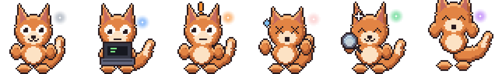
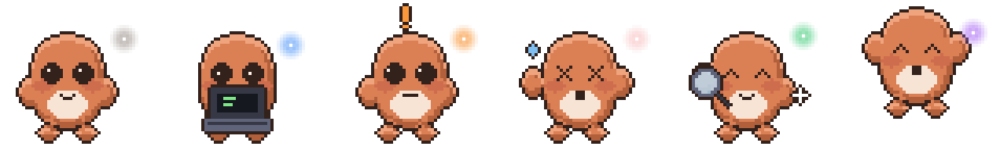

# Custom pets

[← README](../../README.md)

Three pets ship with the app, switchable from the right-click menu.

**Byte** — a CRT-headed bot whose screen shows the state as a face, so the pet
is readable on its own without looking at the card. The default.


**Pip** — an ember-fox with a floating status wisp.



**Ember** — a clay pebble with a spark for a status light.



None of them uses anyone's logo or branding. If you want a mascot that does,
that is your call to make on your own machine.

## Making one

A pet is a folder with two files:

```
~/.pipsqueak/pets/my-pet/
  pet.json
  spritesheet.png
```

```json
{
  "id": "my-pet",
  "displayName": "My Pet",
  "description": "Says hello.",
  "spritesheetPath": "spritesheet.png",
  "frameWidth": 48,
  "frameHeight": 48,
  "columns": 8,
  "rows": 9,
  "frameCounts": [6, 8, 8, 4, 5, 8, 6, 6, 6],
  "fps": 8
}
```

The atlas is one row per state, one column per frame:

| Row | State | Frames |
| --- | --- | --- |
| 0 | idle | 6 |
| 1 | running-right | 8 |
| 2 | running-left | 8 |
| 3 | waving | 4 |
| 4 | jumping | 5 |
| 5 | failed | 8 |
| 6 | waiting | 6 |
| 7 | running | 6 |
| 8 | review | 6 |

## Timing

`fps` gives every frame the same duration, which is what makes a short loop read
as a metronome. `frameDurations` holds each frame for as long as you like, in
milliseconds — one array per row, one entry per frame:

```json
"frameDurations": [
  [520, 120, 90, 90, 120, 420],
  [110, 110, 110, 110, 110, 110, 110, 110]
]
```

Holding the frames where the pet is at rest and snapping through the middle is
most of what makes the same six frames read as breathing. Rows you leave out
fall back to `fps`.

## Codex compatibility

Omit the geometry fields and Pipsqueak assumes the Codex defaults (192×208
cells, `spritesheet.webp`), so **pets built for the Codex app work here
unchanged** — including ones already installed in `~/.codex/pets`, which show up
in the menu automatically. It works in the other direction too: copy
`~/.pipsqueak/pets/*` into `~/.codex/pets/` and they run there.

## The built-in ones

All three are generated rather than drawn. [`tools/pixel.mjs`](../../tools/pixel.mjs)
is the shared toolkit; [`gen-byte.mjs`](../../tools/gen-byte.mjs),
[`gen-sprites.mjs`](../../tools/gen-sprites.mjs) and
[`gen-ember.mjs`](../../tools/gen-ember.mjs) are the characters. `npm run
sprites` rebuilds every atlas, and each file is a short read if you want a
palette-swapped variant.

The generators are deterministic and CI asserts it, so a hand-edited PNG that
no longer matches its generator fails the build rather than drifting quietly.
